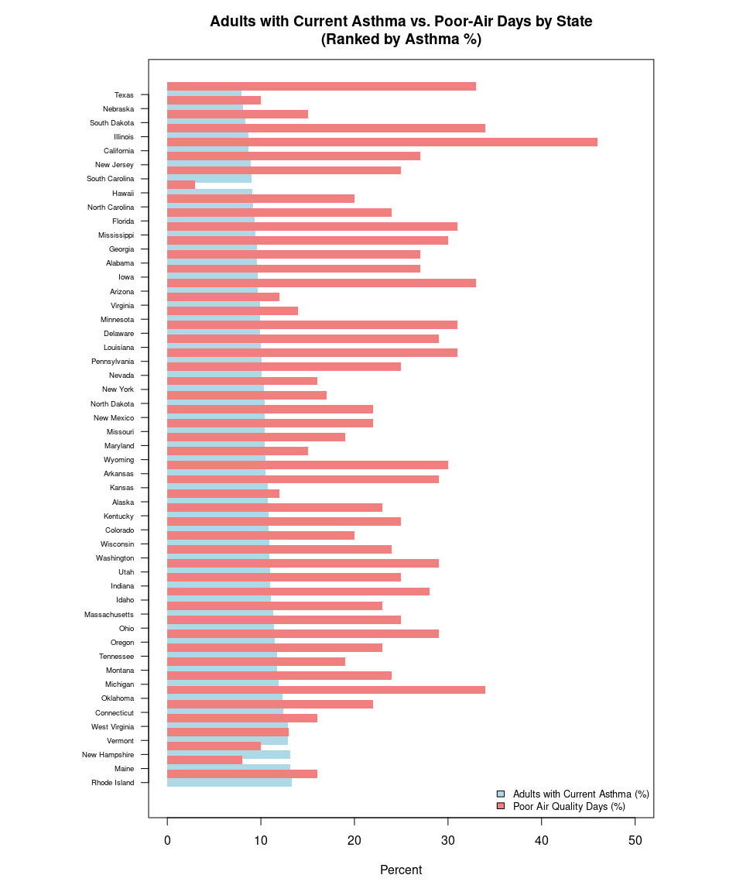
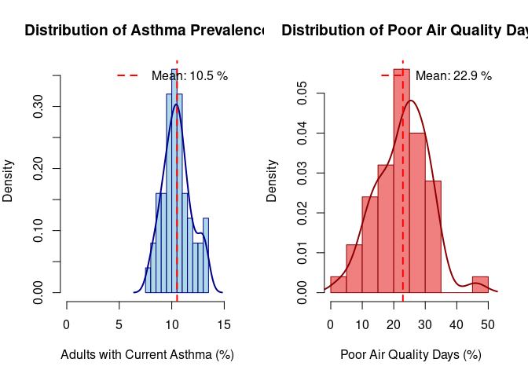
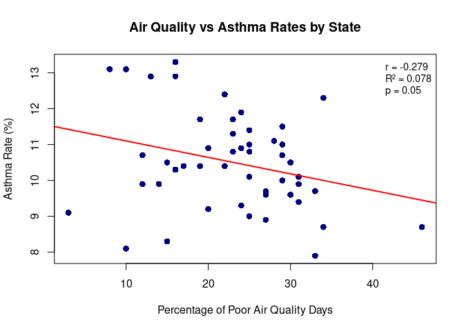

Group Project
================
Keyan Cummins
2025-12-02

- [ABSTRACT](#abstract)
- [BACKGROUND](#background)
- [STUDY QUESTION and HYPOTHESIS](#study-question-and-hypothesis)
  - [Questions](#questions)
  - [Hypothesis](#hypothesis)
  - [Prediction](#prediction)
- [METHODS](#methods)
  - [Statistical Methods](#statistical-methods)
- [RESULTS](#results)
  - [1st Analysis (Normality
    Assessment)](#1st-analysis-normality-assessment)
  - [2nd Analysis (Linear Regression)](#2nd-analysis-linear-regression)
  - [3rd Analysis (Pearson
    Correlation)](#3rd-analysis-pearson-correlation)
- [DISCUSSION](#discussion)
  - [Interpretation of Findings](#interpretation-of-findings)
- [CONCLUSION](#conclusion)
- [REFERENCES](#references)

# ABSTRACT

This study investigates the relationship between state-level outdoor air
quality and adult asthma prevalence across the 50 U.S. states. Using
simple linear regression and Pearson correlation, the analysis tested
the hypothesis that states with a higher percentage of poor air quality
days would exhibit higher asthma rates. The data revealed a weak,
statistically significant negative correlation (r = -0.279, p = 0.0497)
between poor air quality days and asthma prevalence. This finding
indicates that outdoor air quality accounts for less than 8% of the
variability in state asthma rates and that the overall prevalence is
more likely driven by powerful confounding factors such as indoor air
quality, public health practices, or regional climate. The results
reject the initial hypothesis and suggest that a simple, direct link
between state-level outdoor air quality and asthma prevalence is not
supported by this dataset.

# BACKGROUND

Asthma is a chronic lung condition that causes difficulty in breathing
due to inflammation and constricted airways in the lungs \[1\]. There
are many different kinds of asthma, including exercise-induced,
occupational, and allergy-induced asthma \[1\]. For instance,
individuals with occupational asthma can have attacks triggered by
exposures such as gases, fumes, and dust, which are similar to
components found in air pollution \[1\]. The severity of the condition
differs from person to person, with some only experiencing minor
symptoms while others can face life-threatening challenges \[1\]. Asthma
is a common disease in the U.S., affecting approximately 28 million
people \[2\].

Poor ambient air quality is known to impact those who suffer from asthma
by causing their condition to worsen and triggering attacks \[6\].
Epidemiological studies have found that greater levels of air pollution
are associated with childhood asthma, and an improvement in air quality
has been linked to a reduction in childhood asthma incidence \[5\]. It
is believed that air quality can affect the prevalence of asthma per
state. The state with the worst air quality in the U.S. is often cited
as California due due to its high air pollution levels.

We hypothesize that states that have a higher amount of poor air quality
days will have a higher prevalence of asthma. We predict that
California, with its reported high levels of poor air quality days, will
exhibit one of the highest rates of adult asthma compared to other
states.

``` r
# Load the data
air_data <- data.frame(
  State = c("Alabama", "Alaska", "Arizona", "Arkansas", "California", "Colorado", "Connecticut", "Delaware", "Florida", "Georgia", "Hawaii", "Idaho", "Illinois", "Indiana", "Iowa", "Kansas", "Kentucky", "Louisiana", "Maine", "Maryland", "Massachusetts", "Michigan", "Minnesota", "Mississippi", "Missouri", "Montana", "Nebraska", "Nevada", "New Hampshire", "New Jersey", "New Mexico", "New York", "North Carolina", "North Dakota", "Ohio", "Oklahoma", "Oregon", "Pennsylvania", "Rhode Island", "South Carolina", "South Dakota", "Tennessee", "Texas", "Utah", "Vermont", "Virginia", "Washington", "West Virginia", "Wisconsin", "Wyoming"),
  Poor_Air = c(0.27, 0.12, 0.33, 0.3, 0.46, 0.25, 0.22, 0.31, 0.24, 0.3, 0.03, 0.28, 0.34, 0.25, 0.27, 0.29, 0.23, 0.29, 0.08, 0.19, 0.23, 0.24, 0.14, 0.31, 0.22, 0.19, 0.1, 0.25, 0.1, 0.27, 0.22, 0.16, 0.2, 0.17, 0.25, 0.34, 0.29, 0.31, 0.16, 0.25, 0.15, 0.23, 0.33, 0.29, 0.13, 0.12, 0.24, 0.16, 0.2, 0.15),
  Asthma = c(9.6, 10.7, 9.7, 10.5, 8.7, 10.8, 12.4, 9.9, 9.3, 9.6, 9.1, 11.1, 8.7, 11, 9.7, 10.7, 10.8, 10, 13.1, 10.4, 11.3, 11.9, 9.9, 9.4, 10.4, 11.7, 8.1, 10.1, 13.1, 8.9, 10.4, 10.3, 9.2, 10.4, 11.4, 12.3, 11.5, 10.1, 13.3, 9, 8.3, 11.7, 7.9, 11, 12.9, 9.9, 10.9, 12.9, 10.9, 10.5)
)
```

``` r
# Use the existing air_data from our environment
# Convert to appropriate format and calculate percentages
df <- data.frame(
  State = air_data$State,
  asthma_pct = air_data$Asthma,
  poor_air_pct = air_data$Poor_Air * 100  # Convert proportion to percentage
)

# Sort by asthma percentage (descending)
df <- df[order(-df$asthma_pct), ]

# Set up plotting parameters
par(mar = c(5, 10, 4, 6))  # Adjust margins for state names
y_pos <- 1:nrow(df)  # Y positions for bars

# Create empty plot
plot(0, 0, type = "n", 
     xlim = c(0, 50), 
     ylim = c(0.5, nrow(df) + 0.5),
     xlab = "Percent", 
     ylab = "",
     main = "Adults with Current Asthma vs. Poor-Air Days by State\n(Ranked by Asthma %)",
     yaxt = "n")  # No default y-axis

# Add asthma bars (blue)
barplot_height <- df$asthma_pct
rect(xleft = 0, ybottom = y_pos - 0.3, 
     xright = barplot_height, ytop = y_pos + 0.3,
     col = "lightblue", border = NA)

# Add air quality bars (red) - offset slightly
barplot_height_air <- df$poor_air_pct
rect(xleft = 0, ybottom = y_pos - 0.3 + 0.6, 
     xright = barplot_height_air, ytop = y_pos + 0.3 + 0.6,
     col = "lightcoral", border = NA)

# Add state names
axis(2, at = y_pos, labels = df$State, las = 1, cex.axis = 0.6)

# Add legend
legend("bottomright", 
       legend = c("Adults with Current Asthma (%)", "Poor Air Quality Days (%)"),
       fill = c("lightblue", "lightcoral"),
       cex = 0.8,
       bty = "n")
```

<figure>

<figcaption aria-hidden="true">Adults with Current Asthma vs. Poor-Air
Days by State (ranked by Asthma %)</figcaption>
</figure>

``` r
# This code was edited by prompts I gave to ChatGTP
```

# STUDY QUESTION and HYPOTHESIS

## Questions

Does air quality effect the prevalence of asthma per state?

## Hypothesis

The states with the highest amounts of poor air quality days will also
have higher prevalence of asthma.

## Prediction

California will have the highest prevelance of asthma because of its
high amounts of poor air quality days.

# METHODS

Data Source and Sample SizeThe study utilized publicly available data
from the United States Environmental Protection Agency (EPA) on two key
variables for all 50 U.S. states (sample size n=50)

Poor Air Quality Days (Predictor/Independent Variable): The proportion
of days with an Air Quality Index (AQI) value above 50, indicating an
unhealthy level of air quality for sensitive groups or the general
population.

Adult Asthma Prevalence (Response/Dependent Variable): The percentage of
adults (aged 18+) who currently have asthma.

## Statistical Methods

1.  Normality Assessment To ensure the validity of the statistical
    approach for parametric tests like Pearson correlation and simple
    linear regression, the distribution of both the Poor Air Quality
    Days and Asthma Prevalence variables was assessed using histograms
    (with density curves) and the formal Shapiro-Wilk test. The null
    hypothesis for the Shapiro-Wilk test is that the data is normally
    distributed (alpha = 0.05).

2.  Simple Linear Regression Simple Linear Regression was used to model
    the relationship between the predictor (Poor Air Quality Days) and
    the response (Asthma Rate). The analysis yielded the regression
    equation, the R-squared (R^2) value (Coefficient of Determination),
    and the regression p-value to determine the overall fit and
    significance of the model.

3.  Pearson Correlation A Pearson correlation test was performed to
    formally test the null hypothesis that there is no linear
    relationship between the two variables. This analysis produced the
    Pearson correlation coefficient , a measure of the strength and
    direction of the linear relationship, along with a 95% confidence
    interval and a p-value for statistical significance.

# RESULTS

## 1st Analysis (Normality Assessment)

The Shapiro-Wilk tests for normality, presented in Table 1, indicated
that both variables could be considered normally distributed at the
alpha = 0.05 significance level, thus meeting the assumptions for the
planned parametric tests.

``` r
# Set up side-by-side plots
par(mfrow = c(1, 2), mar = c(5, 4, 4, 2))

# Histogram with density curve for Asthma
hist(df$asthma_pct, 
     breaks = 15,
     main = "Distribution of Asthma Prevalence",
     xlab = "Adults with Current Asthma (%)",
     ylab = "Density",
     col = "lightblue",
     border = "darkblue",
     freq = FALSE,
     xlim = c(0, max(df$asthma_pct) + 2))

# Add density curve
lines(density(df$asthma_pct), col = "darkblue", lwd = 2)


# Histogram with density curve for Poor Air Quality
hist(df$poor_air_pct, 
     breaks = 15,
     main = "Distribution of Poor Air Quality Days",
     xlab = "Poor Air Quality Days (%)",
     ylab = "Density",
     col = "lightcoral",
     border = "darkred",
     freq = FALSE,
     xlim = c(0, max(df$poor_air_pct) + 5))

# Add density curve
lines(density(df$poor_air_pct), col = "darkred", lwd = 2)
```

<!-- -->

``` r
# Reset plotting parameters
par(mfrow = c(1, 1))

# This code was edited by prompts I gave to ChatGTP
```

``` r
# Shapiro-Wilk tests for normality
shapiro_poor_air <- shapiro.test(air_data$Poor_Air)
shapiro_asthma <- shapiro.test(air_data$Asthma)

# Create results table
normality_tests <- data.frame(
  Variable = c("Poor Air Quality Days", "Asthma Rate"),
  Statistic_W = c(round(shapiro_poor_air$statistic, 4), 
                  round(shapiro_asthma$statistic, 4)),
  P_Value = c(ifelse(shapiro_poor_air$p.value < 0.001, "< 0.001", 
                     round(shapiro_poor_air$p.value, 4)),
              ifelse(shapiro_asthma$p.value < 0.001, "< 0.001", 
                     round(shapiro_asthma$p.value, 4))),
  Normal_Distribution = c(ifelse(shapiro_poor_air$p.value > 0.05, "Yes", "No"),
                          ifelse(shapiro_asthma$p.value > 0.05, "Yes", "No"))
)

# Display results
knitr::kable(normality_tests, caption = "Shapiro-Wilk Normality Tests")
```

| Variable              | Statistic_W | P_Value | Normal_Distribution |
|:----------------------|------------:|--------:|:--------------------|
| Poor Air Quality Days |      0.9798 |  0.5452 | Yes                 |
| Asthma Rate           |      0.9768 |  0.4249 | Yes                 |

Shapiro-Wilk Normality Tests

``` r
# This code was edited by prompts I gave to ChatGTP
```

## 2nd Analysis (Linear Regression)

The regression analysis produced the following model, statistics, and
scatter plot.

``` r
## 1st Analysis: Linear Regression - Air Quality vs Asthma Rates

# Convert Poor_Air from proportion to percentage
air_data$Poor_Air_Percent <- air_data$Poor_Air * 100

# Scatter plot with regression line
plot(air_data$Poor_Air_Percent, air_data$Asthma,
     xlab = "Percentage of Poor Air Quality Days",
     ylab = "Asthma Rate (%)",
     main = "Air Quality vs Asthma Rates by State",
     pch = 16, col = "navyblue", cex = 1.2)

# Add regression line
model <- lm(Asthma ~ Poor_Air_Percent, data = air_data)
abline(model, col = "red", lwd = 2)

# Calculate statistics
correlation <- cor(air_data$Poor_Air_Percent, air_data$Asthma)
r_squared <- summary(model)$r.squared
p_value <- summary(model)$coefficients[2,4]

# Create comprehensive results table
regression_stats <- data.frame(
  Statistic = c("Correlation Coefficient", "R-squared", "Adjusted R-squared", 
                "Overall Model p-value", "Regression p-value", "Observations"),
  Value = c(round(correlation, 3),
            round(r_squared, 3),
            round(summary(model)$adj.r.squared, 3),
            round(pf(summary(model)$fstatistic[1], summary(model)$fstatistic[2], 
                     summary(model)$fstatistic[3], lower.tail = FALSE), 4),
            round(p_value, 4),
            nrow(air_data))
)


# Create coefficients table
coefficients_table <- data.frame(
  Term = c("Intercept", "Poor Air Quality (%)"),
  Estimate = c(round(coef(model)[1], 3), round(coef(model)[2], 3)),
  Std_Error = c(round(summary(model)$coefficients[1,2], 3), 
                round(summary(model)$coefficients[2,2], 3)),
  t_value = c(round(summary(model)$coefficients[1,3], 3), 
              round(summary(model)$coefficients[2,3], 3)),
  p_value = c(round(summary(model)$coefficients[1,4], 4), 
              round(summary(model)$coefficients[2,4], 4))
)


# Add clean statistics to plot
legend("topright", 
       legend = c(paste("r =", round(correlation, 3)),
                  paste("R² =", round(r_squared, 3)),
                  paste("p =", ifelse(p_value < 0.001, "< 0.001", round(p_value, 3)))),
       bty = "n", cex = 0.9)
```

<!-- -->

``` r
# This code was edited by prompts I gave to ChatGTP
```

## 3rd Analysis (Pearson Correlation)

The formal Pearson correlation test results confirmed a weak, negative
association between the variables.

``` r
## Pearson Correlation Analysis

# Calculate Pearson correlation
cor_test <- cor.test(air_data$Poor_Air, air_data$Asthma, method = "pearson")

# Create correlation results table
correlation_table <- data.frame(
  Statistic = c("Pearson Correlation Coefficient", 
                "95% Confidence Interval Lower",
                "95% Confidence Interval Upper",
                "t-statistic",
                "Degrees of Freedom",
                "p-value",
                "Sample Size"),
  Value = c(round(cor_test$estimate, 3),
            round(cor_test$conf.int[1], 3),
            round(cor_test$conf.int[2], 3),
            round(cor_test$statistic, 3),
            cor_test$parameter,
            ifelse(cor_test$p.value < 0.001, "< 0.001", round(cor_test$p.value, 4)),
            nrow(air_data))
)

# Display correlation results
knitr::kable(correlation_table, caption = "Pearson Correlation Analysis")
```

| Statistic                       |   Value |
|:--------------------------------|--------:|
| Pearson Correlation Coefficient | -0.2790 |
| 95% Confidence Interval Lower   | -0.5170 |
| 95% Confidence Interval Upper   | -0.0010 |
| t-statistic                     | -2.0130 |
| Degrees of Freedom              | 48.0000 |
| p-value                         |  0.0497 |
| Sample Size                     | 50.0000 |

Pearson Correlation Analysis

``` r
# This code was edited by prompts I gave to ChatGTP
```

# DISCUSSION

## Interpretation of Findings

The study found a statistically significant weak negative linear
relationship between the percentage of poor air quality days and adult
asthma prevalence across the 50 U.S. states (r = -0.279, p = 0.0497).
This result, while statistically significant at the alpha = 0.05 level,
directly rejects the initial hypothesis and prediction.

Our hypothesis predicted a positive correlation, suggesting that higher
poor air quality would lead to higher asthma rates. Instead, the data
indicates that states with a higher frequency of poor air quality days
(like California, 46% poor air days, 8.7% asthma) tend to have slightly
lower adult asthma prevalence rates compared to states with better air
quality (like Maine, 8% poor air days, 13.1% asthma).

The R^2 value of 0.078 shows that only 7.8% of the variability in
state-level asthma rates is explained by outdoor air quality. This low
value strongly suggests that the overall state-level asthma prevalence
is overwhelmingly influenced by other, more powerful confounding
factors.

# CONCLUSION

The study found a statistically significant but weak negative linear
relationship r = -0.279, p = 0.0497 between the percentage of poor air
quality days and adult asthma prevalence across the 50 US states. While
the results are statistically significant, they reject the initial
hypothesis and prediction. We predicted a positive relationship where
poor air quality leads to higher asthma rates, but the data shows the
opposite. These findings suggests that state-level asthma prevalence is
likely caused by other powerful factors that may be related to the
asthma rate, such as socioeconomic status, access to healthcare, smoking
rates, or potentially the “healthy worker effect” where individuals with
respiratory issues might move away from areas with known poor air
quality. Future research should look at some of these confounding
variables to see the trends they have.

# REFERENCES

1.  “Asthma.” Mayo Clinic, Mayo Foundation for Medical Education and
    Research, 8 Mar. 2025,
    www.mayoclinic.org/diseases-conditions/asthma/symptoms-causes/syc-20369653.

2.  “Asthma Facts.” Asthma & Allergy Foundation of America, 23
    Apr. 2025, aafa.org/asthma/asthma-facts/.

3.  ChatGPT. OpenAI, version Jan 2025. Used as a reference for functions
    such as plot() and to correct syntax errors. Accessed r Sys.Date().

4.  Google. (2025). Gemini (version Oct 2025). Tool used for quick
    fixes, editing grammar and flow of text, and checking all rubric
    requirements were met.

5.  “Jama Network \| Home of Jama and the Specialty Journals of the
    American Medical Association.” Jama Network, jamanetwork.com/.
    Accessed 12 Nov. 2025.

6.  Tiotiu AI, Novakova P, Nedeva D, Chong-Neto HJ, Novakova S,
    Steiropoulos P, Kowal K. Impact of Air Pollution on Asthma Outcomes.
    Int J Environ Res Public Health. 2020 Aug 27;17(17):6212. doi:
    10.3390/ijerph17176212. PMID: 32867076; PMCID: PMC7503605.

7.  U.S. Environmental Protection Agency (EPA). Asthma and Outdoor Air
    Pollution \[flyer\]. EPA-452-F-04-002. Used for background
    information on how outdoor air pollution affects asthma and
    suggested protective behaviors. Accessed r Sys.Date().
